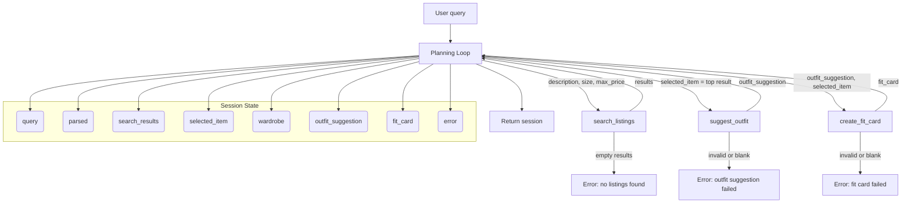

# FitFindr — planning.md

> Complete this document before writing any implementation code.
> Your spec and agent diagram are what you'll use to direct AI tools (Claude, Copilot, etc.) to generate your implementation — the more specific they are, the more useful the generated code will be.
> Your planning.md will be reviewed as part of your submission.
> Update it before starting any stretch features.

---

## Tools

List every tool your agent will use. For each tool, fill in all four fields.
You must have at least 3 tools. The three required tools are listed — add any additional tools below them.

### Tool 1: search_listings

**What it does:**
Search the mock thrift listings dataset for items that match the user's requested description, optional size, and optional maximum price.

**Input parameters:**
- `description` (str): A cleaned keyword string describing the desired item, such as "vintage graphic tee" or "bright running sneakers".
- `size` (str | None): A requested size token from the query, such as "M", "S", or "XL". If the user does not specify size, this is None.
- `max_price` (float | None): The highest acceptable price in dollars (e.g. 30.0). If the user does not specify a budget, this is None.

**What it returns:**
A list of matching listing dictionaries sorted by relevance. Each dictionary contains:
- `id`
- `title`
- `description`
- `category`
- `style_tags`
- `size`
- `condition`
- `price`
- `colors`
- `brand`
- `platform`

If no listings match the query, it returns an empty list.

**What happens if it fails or returns nothing:**
If `search_listings` returns an empty list, the agent should set `session["error"]` to a clear message and return early without calling `suggest_outfit` or `create_fit_card`.

---

### Tool 2: suggest_outfit

**What it does:**
Given a selected thrift listing and the user's wardrobe, generate an outfit recommendation that pairs the new item with existing pieces or offers general styling guidance if the wardrobe is empty.

**Input parameters:**
- `new_item` (dict): The selected listing dict returned from `search_listings`, including fields such as `title`, `category`, `price`, `size`, `brand`, and `platform`.
- `wardrobe` (dict): A wardrobe dict containing an `items` list of existing wardrobe item dictionaries.

**What it returns:**
A non-empty string describing one or two outfit combinations. If the wardrobe has items, the recommendation should mention specific wardrobe pieces by name. If the wardrobe is empty, it should still return general styling advice for the new item.

**What happens if it fails or returns nothing:**
If the tool cannot generate a valid outfit string or returns empty content, the agent should set `session["error"]` to a helpful message and stop the loop.

---

### Tool 3: create_fit_card

**What it does:**
Generate a short, shareable caption for the thrift find using the outfit recommendation and the selected listing details.

**Input parameters:**
- `outfit` (str): The outfit suggestion string returned from `suggest_outfit`.
- `new_item` (dict): The selected listing dict from `search_listings`.

**What it returns:**
A 2–4 sentence caption string that mentions the item name, price, platform, and outfit vibe in a natural, authentic tone.

**What happens if it fails or returns nothing:**
If the `outfit` text is missing or blank, `create_fit_card` should return a descriptive fallback string rather than raising an exception. If the tool still cannot produce a valid caption, the agent should set `session["error"]` and return early.

---

### Additional Tools (if any)

No additional tools are required for the basic planning loop.

---

## Planning Loop

**How does your agent decide which tool to call next?**
The agent follows a fixed sequence with explicit success/failure checks after each tool.
1. Parse the query into `description`, `size`, and `max_price`.
2. Call `search_listings(description, size, max_price)`.
   - If `search_results` is empty, set `session["error"]` to a clear user-facing message and return the session.
   - Otherwise, set `session["selected_item"] = search_results[0]`.
3. Call `suggest_outfit(selected_item, wardrobe)`.
   - If the returned string is empty or invalid, set `session["error"]` and return early.
   - Otherwise, store it in `session["outfit_suggestion"]`.
4. Call `create_fit_card(outfit_suggestion, selected_item)`.
   - If the returned caption is empty or invalid, set `session["error"]` and return early.
   - Otherwise, store it in `session["fit_card"]`.
5. If all steps succeed, return the completed session dict.

The agent does not skip tools or rearrange the sequence; it only branches to an early return when a tool fails or returns no usable output.

---

## State Management

**How does information from one tool get passed to the next?**
The agent stores all data in a single `session` dict. Each tool's output is written to a dedicated field and then read by the next step:
- `session["query"]` keeps the original user text.
- `session["parsed"]` stores the extracted `description`, `size`, and `max_price`.
- `session["search_results"]` stores the list returned by `search_listings`.
- `session["selected_item"]` stores the top matching listing.
- `session["wardrobe"]` persists the user’s wardrobe input.
- `session["outfit_suggestion"]` stores the string returned by `suggest_outfit`.
- `session["fit_card"]` stores the caption returned by `create_fit_card`.
- `session["error"]` stores any fatal error message.

The planning loop reads `session["parsed"]` to call `search_listings`, then reads `session["search_results"][0]` to call `suggest_outfit`, and finally reads `session["outfit_suggestion"]` plus `session["selected_item"]` to call `create_fit_card`. If `session["error"]` is set at any point, the loop returns immediately.

---

## Error Handling

For each tool, describe the specific failure mode you're handling and what the agent does in response.

| Tool | Failure mode | Agent response |
|------|-------------|----------------|
| search_listings | No results match the query | Set `session["error"]` to: "No listings matched your description, size, and price. Try broadening your query or removing the size or price filter." Return the session early. |
| suggest_outfit | Wardrobe is empty | Continue without error. Return a general styling advice string that still helps the user work with the item. |
| create_fit_card | Outfit input is missing or incomplete | Return a descriptive fallback caption string and, if the caption is still invalid, set `session["error"]` to: "I couldn't create a fit card from that outfit suggestion. Please try again or search for a different item." |

---

## Architecture

---

## AI Tool Plan

For each implementation stage, I will give the AI tool the exact sections of this planning document plus the agent diagram so the code matches the design.

**Milestone 3 — Individual tool implementations:**
- `search_listings`: Use Claude with the Tool 1 block and `utils/data_loader.py`. Prompt it to implement listing loading, size and price filtering, keyword scoring, and result sorting. Verify by reviewing the code for explicit `size`/`max_price` guards and by testing at least three queries including one with no results.
- `suggest_outfit`: Use ChatGPT with the Tool 2 block and the wardrobe schema. Prompt it to generate a function that handles both empty and populated wardrobes, returning styled suggestions or general advice. Verify by reviewing the logic and testing with an empty wardrobe and the sample example wardrobe.
- `create_fit_card`: Use Copilot with the Tool 3 block and caption requirements. Prompt it to guard against missing outfit text, combine item and outfit details, and return a 2–4 sentence caption. Verify by checking the prompt construction and testing both valid and missing-outfit cases.

**Milestone 4 — Planning loop and state management:**
- `run_agent`: Use Claude with the completed `Planning Loop`, `State Management`, `Error Handling`, and `Architecture` sections. Provide the exact session fields and diagram. Expect a function that parses the query, updates session state step-by-step, calls the tools in order, and returns early on failure. Verify by reviewing the control flow and running the CLI test cases in `agent.py`.

---

## A Complete Interaction (Step by Step)

Write out what a full user interaction looks like from start to finish — tool call by tool call. Use a specific example query.

**Example user query:** "I'm looking for a vintage graphic tee under $30. I mostly wear baggy jeans and chunky sneakers. What's out there and how would I style it?"

FitFindr should parse the user query to extract the desired item description, size, and price limit, then use `search_listings` to find matching marketplace items. If a matching listing is found, it passes that top item plus the user's wardrobe into `suggest_outfit` to generate styling ideas, and finally uses `create_fit_card` to format the recommendation; if any step fails, it stops early and returns a clear error instead of continuing.

**Step 1:**
The agent parses the query and extracts `description = "vintage graphic tee"`, `size = None`, and `max_price = 30.0`. It stores these values in `session["parsed"]`.

**Step 2:**
The planning loop calls `search_listings(description="vintage graphic tee", size=None, max_price=30.0)`. `search_listings` returns a ranked list of matching listings.

**Step 3:**
The agent checks the results. If the list is empty, it sets `session["error"]` to "No listings matched your description, size, and price. Try broadening your query or removing the size or price filter." and returns. If not empty, it sets `session["selected_item"]` to the top listing.

**Step 4:**
The agent calls `suggest_outfit(new_item=selected_item, wardrobe=wardrobe)`. The tool returns a string describing how to style the thrifted tee with wardrobe pieces, and the agent stores it in `session["outfit_suggestion"]`.

**Step 5:**
The agent calls `create_fit_card(outfit=session["outfit_suggestion"], new_item=selected_item)`. The tool returns a short caption, which the agent stores in `session["fit_card"]`.

**Final output to user:**
If every step succeeds, the final session contains `fit_card` with a 2–4 sentence caption and `outfit_suggestion` with styling guidance. If any tool failed, `session["error"]` contains the failure message instead.
